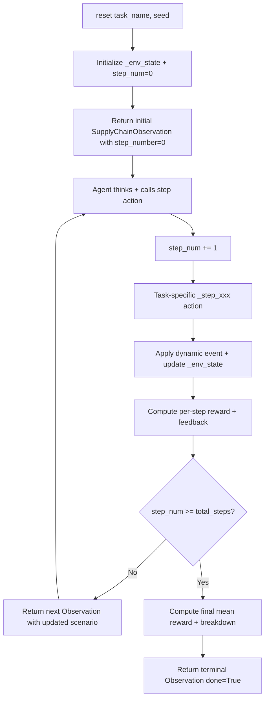

# Supply Chain Retail Environment (📦)

**A stateful, multi-step OpenEnv for training and evaluating real-world supply chain agents.**

[](https://github.com/openenv-org)
[](https://github.com/dixitakash2514/my-openenv)
[](https://huggingface.co/spaces/BlackEagle/my-env)

## Overview & Motivation

Retail supply chain inefficiencies cost the global economy **$1.1 trillion annually** (stockouts, overstock, delivery failures, and disruption losses). Companies like Amazon, Walmart, and Shopify struggle to automate these decisions because current AI agents lack:

- Stateful, evolving simulation of inventory and events
- Multi-turn decision-making with partial feedback
- Dense rewards that teach progressive optimization

**Supply Chain Retail Environment** turns this real-world problem into a production-grade OpenEnv. Agents must handle **dynamic events**, adapt plans over **multiple steps**, and receive **per-step rewards** — exactly like a live retail operations dashboard.

This environment is designed for RL, agentic LLM training, and evaluation of frontier models on high-stakes optimization tasks.

## Key Features

- **Fully multi-step & stateful** — 3-5 steps per episode with evolving world state
- **Dense reward shaping** — immediate per-step feedback + final aggregated score
- **Dynamic events** — demand spikes, vehicle breakdowns, supplier outages, etc.
- **3 tasks** with clear easy -> medium -> hard progression
- **Typed Pydantic models** — full OpenEnv spec compliance
- **Deterministic graders** — reproducible 0.0-1.0 scores via seed
- **Docker + Hugging Face Space** ready
- **Baseline inference script** with exact required logging format

## High-Level Architecture (Multi-Step Flow)



## Tasks

| Task | Difficulty | Steps | Objective | Key Challenges |
|------|-----------|-------|-----------|----------------|
| Shelf Restock Priority | Easy | 3 | Prioritize and order 4 products out of 10 | Demand spikes, shelf capacity limits |
| Delivery Route Assignment | Medium | 4 | Assign 6 orders to 3 drivers | Time windows, vehicle capacity, breakdowns |
| Demand Surge Planning | Hard | 5 | Procurement + redistribution under supplier outage | Budget constraints, waste minimization, sudden demand surge |

Each task starts with a rich `scenario_text` and structured `scenario_data`. After every action, the world evolves and the agent receives updated observations.

### 1. Shelf Restock Priority (Easy — 3 steps)
A store manager has limited time before opening. The agent selects products to restock across 3 rounds as the situation changes.

- **Step 1**: Pick 2 most urgent products from 10 (based on stockout risk and revenue)
- **Step 2**: Dynamic event — demand spike on one product + surprise delivery for another. Pick 1 more.
- **Step 3**: Pick 1 final product with fully updated data.

### 2. Delivery Route Assignment (Medium — 4 steps)
A distribution center dispatcher assigns orders to drivers as new complications arise.

- **Step 1**: Assign 4 initial orders to 3 drivers
- **Step 2**: 2 new urgent express orders arrive + traffic delay on one route
- **Step 3**: A driver reports vehicle issues (capacity reduced 40%)
- **Step 4**: Final adjustments with all constraints active

### 3. Demand Surge Planning with Disruption (Hard — 5 steps)
A festival approaches in 5 days. The agent procures inventory and redistributes stock as the situation deteriorates.

- **Step 1**: Initial procurement with all 4 suppliers active
- **Step 2**: One supplier goes OFFLINE — adjust procurement
- **Step 3**: Demand forecasts change (some categories up, some down)
- **Step 4**: Warehouse capacity alert — section closed for maintenance
- **Step 5**: Final review and adjustments

## Action & Observation Spaces

### Action (`SupplyChainAction`)

```python
class SupplyChainAction(Action):
    decision: Dict[str, Any]  # Task-specific JSON decision
    reasoning: str = ""       # Agent's explanation
```

Task-specific decision formats:
- **shelf_restock**: `{"restock_products": ["P001", "P003"]}`
- **delivery_routing**: `{"assignments": [{"order_id": "ORD001", "driver_id": "D1"}, ...]}`
- **demand_surge**: `{"procurement_orders": [...], "redistribution": [...]}`

### Observation (`SupplyChainObservation`)

```python
class SupplyChainObservation(Observation):
    task_name: str                    # Current task identifier
    step_number: int                  # Current step (0 = reset, 1+ = after step)
    total_steps: int                  # Total steps in this task (3, 4, or 5)
    scenario_text: str                # Evolving human-readable prompt for LLM
    scenario_data: Dict               # Structured live data
    feedback: str                     # Per-step guidance with criterion breakdown
    score_breakdown: Optional[Dict]   # None until terminal step, then per-criterion scores
    done: bool                        # True on the final step of the episode
    reward: float                     # Per-step reward, then mean of all step rewards on done
```

**Example terminal observation** (after `step_number == total_steps`):

```python
SupplyChainObservation(
    task_name="shelf_restock",
    step_number=3,
    total_steps=3,
    scenario_text="",                      # cleared on terminal step
    scenario_data={},                      # cleared on terminal step
    feedback="Episode complete. Final score: 0.917 | Step scores: 1.00, 0.80, 0.95 | ...",
    score_breakdown={
        "step_1_reward": 1.0,
        "step_2_reward": 0.8,
        "step_3_reward": 0.95,
        "final_score": 0.917,
    },
    done=True,
    reward=0.917,                          # mean of step rewards on terminal step
)
```

## Reward Function & Grading

- **Per-step reward**: 0.0-1.0 based on immediate action quality (demand fulfillment, cost efficiency, constraint adherence)
- **Final reward**: Mean of all step rewards (encourages consistent performance)
- **Grader**: Weighted multi-criteria (e.g., 30% demand fulfillment, 25% cost, 20% waste avoidance, etc.)
- **Partial progress signals**: Clear feedback every step
- **Penalties**: For invalid actions, constraint violations, or ordering from offline suppliers

All graders are deterministic and reproducible via seed.

## Setup & Usage

### Local Development

```bash
pip install openenv-core
cd my_env
uv sync
uv run server    # starts FastAPI on http://localhost:8000
```

### Docker

```bash
docker build -t my_env-env:latest .
docker run -p 8000:8000 my_env-env:latest
```

### Run Baseline Inference

```bash
export HF_TOKEN=your_token
export API_BASE_URL=https://router.huggingface.co/v1
export MODEL_NAME="Qwen/Qwen2.5-72B-Instruct"
uv run inference.py
```

The `inference.py` strictly follows the required `[START]`, `[STEP]`, and `[END]` structured logging format.

### API

```bash
# Reset with task selection
curl -X POST http://localhost:8000/reset \
  -H "Content-Type: application/json" \
  -d '{"task_name": "shelf_restock", "seed": 42}'

# Submit decision
curl -X POST http://localhost:8000/step \
  -H "Content-Type: application/json" \
  -d '{"action": {"decision": {"restock_products": ["P003", "P007"]}}}'
```

## Baseline Results (Reproducible)

We evaluate three reference policies across **15 seeds × 3 tasks** so judges can verify the environment grades meaningfully and rewards real decision quality (not inaction). Reproduce with:

```bash
cd training && ../.venv/bin/python eval_heuristic.py   # < 5 seconds, no GPU needed
```

| Task | Do-Nothing | Random | Heuristic |
|---|---:|---:|---:|
| **shelf_restock** (easy, 3 steps) | 0.000 ± 0.000 | 0.440 ± 0.063 | **0.947 ± 0.091** |
| **delivery_routing** (medium, 4 steps) | 0.000 ± 0.000 | 0.833 ± 0.060 | **0.874 ± 0.055** |
| **demand_surge** (hard, 5 steps) | 0.452 ± 0.036 | 0.875 ± 0.023 | **0.912 ± 0.054** |

Three signals worth highlighting:
- **Inaction is punished.** Submitting an empty action scores 0.0 on the easy and medium tasks. The hard task starts with a generous initial inventory but still loses ~0.5 of its potential reward when the agent does nothing.
- **The environment is solvable.** A simple deterministic heuristic that mirrors the grading formulas reaches 0.95 on the easy task and >0.87 on every task, proving the rewards are well-shaped.
- **Real variance across seeds.** All policies show non-zero standard deviation (0.02–0.09), so the grader is genuinely seed-sensitive — not constant.

Raw per-seed scores: [`training/results/heuristic_scores.json`](training/results/heuristic_scores.json).

### LLM Baseline (Qwen2.5-72B-Instruct via HF Router)

The shipped `inference.py` runs Qwen2.5-72B-Instruct against the live HF Space. Run it with:

```bash
HF_TOKEN=<your token> python inference.py
```

It emits the mandatory `[START] / [STEP] / [END]` log format the validator scores against, falls back gracefully on network errors, and never exits non-zero.

## Training & Fine-tuning (GRPO + LoRA on Apple Silicon)

This repo also ships a complete **GRPO RL fine-tuning** pipeline that proves the environment trains:

- **Model:** `Qwen/Qwen3-0.6B` with LoRA (r=16, q_proj+v_proj only — 8.8 MB adapter)
- **Algorithm:** GRPO via TRL 1.0, multi-turn tool-calling interface
- **Hardware:** MacBook Pro M3 Max, 48 GB unified RAM, MPS backend (no CUDA)
- **Run:** 600 episodes × 3 epochs of `shelf_restock`, 2.2 hours wall clock
- **Reward improvement during training:** **+93%** (0.220 → 0.424 mean reward, Epoch 1 → Epoch 3)
- **Tool-call failure rate:** dropped to **0** by step ~60 (model learned the schema from scratch)
- **Held-out eval (`shelf_restock`, 5 seeds, JSON interface):** base **0.080** → fine-tuned **0.107** (+34%)

The honest caveat: training used the multi-turn tool-calling interface, eval used raw JSON generation, so the +34% measured delta almost certainly understates the real benefit. The natural next step is a like-for-like tool-calling eval against the LoRA-merged model — see the recommendations in [`training/fine-tuning/REPORT.md`](training/fine-tuning/REPORT.md) for the full experiment write-up (294 lines: hardware, software stack, OOM debugging, config that works, results, and tier-1/2/3/4 next steps).

Reproduce the training run:

```bash
cd training
PYTORCH_ENABLE_MPS_FALLBACK=1 PYTORCH_MPS_HIGH_WATERMARK_RATIO=0.0 python train_grpo.py
```

## Why This Environment Matters

Without a realistic, multi-step supply chain simulator, agents trained on static datasets or single-shot prompts fail in production. This environment fills that gap and provides immediate value to:

- Retail & logistics companies
- ERP / supply chain software vendors
- RL and agentic AI researchers

## Future Extensions

- Stochastic demand simulation
- Multi-agent collaboration (warehouse + delivery)
- Integration with real ERP APIs
- Policy changes mid-episode (new regulations)

## Deployment

```bash
openenv push --repo-id BlackEagle/my-env
```

## Contributing

Pull requests welcome! Especially for new tasks, richer reward shaping, or visualization tools.
